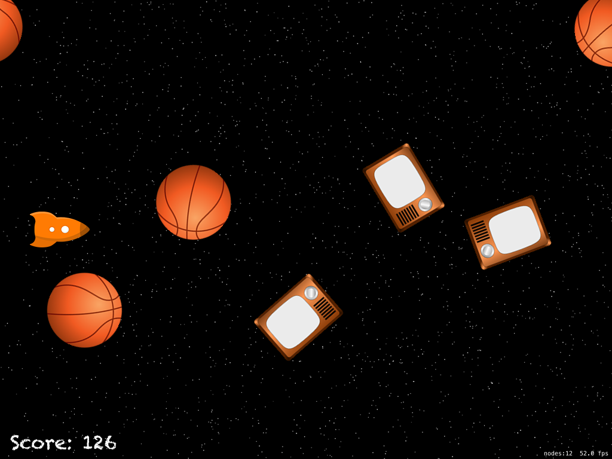

# SpaceRaceGame
Repo following Project 23: Space Race: Per-pixel collision for SKSpriteNode at Hacking with Swift



## Concepts learned/practiced
* Per-pixel collision detection
* Generating random number within a range with GameplayKit's ```GKRandomDistribution``` class
  * Example:
  ```Swift
  let randomDistribution = GKRandomDistribution(lowestValue: 50, highestValue: 736)
  ```
* Practice using ```NSTimer``` to create enemies every 0.35 seconds
  * Example:
  ```Swift
  gameTimer = NSTimer.scheduledTimerWithTimeInterval(0.35, target: self, selector: #selector(createEnemy), userInfo: nil, repeats: true)
  ```
* Linear and angular damping in SpriteKit to create a frictionless space environment
  * Example:
  ```Swift
  sprite.physicsBody?.linearDamping = 0
  sprite.physicsBody?.angularDamping = 0
  ```
* More use of ```guard let```
  * Example:
  ```Swift
  guard let touch = touches.first else { return }
  var location = touch.locationInNode(self)
  ```

## Attributions
[Project 23: Space Race: Per-pixel collision for SKSpriteNode](https://www.hackingwithswift.com/read/23/overview)
